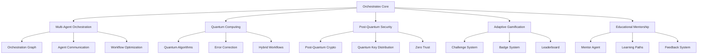
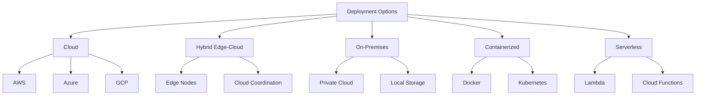

# Orchestratex AEM Architecture

## System Architecture

## Module Architecture

### Multi-Agent Orchestration
- Graph-based agent coordination
- Quantum-entangled communication
- Dynamic workflow optimization
- Error-corrected execution

### Quantum Computing
- Quantum algorithm library
- Error correction layers
- Hybrid quantum-classical workflows
- Cloud quantum integration

### Post-Quantum Security
- NIST-standard PQC
- Quantum key distribution
- Zero trust architecture
- Audit logging

### Adaptive Gamification
- AI-driven challenges
- Quantum-secured randomness
- Dynamic badge system
- Leaderboard integration

### Educational Mentorship
- Personalized learning paths
- Real-time feedback
- Community collaboration
- Gamified learning

## Deployment Architecture

## Security Architecture

### Post-Quantum Security
- Kyber encryption
- Dilithium signatures
- Quantum key distribution
- Hybrid encryption

### Zero Trust Architecture
- RBAC implementation
- Quantum-safe authentication
- Continuous verification
- Micro-segmentation

### Audit & Monitoring
- Quantum-secured logging
- Entanglement-based audit trails
- Real-time monitoring
- Anomaly detection

## Testing Architecture

### Quantum Testing
- Entanglement verification
- Error correction testing
- Hybrid workflow testing
- Fault injection

### Integration Testing
- Multi-agent coordination
- Quantum-classical integration
- Security testing
- Performance testing

### Performance Testing
- Quantum circuit optimization
- Workflow scalability
- Response time measurement
- Resource utilization
