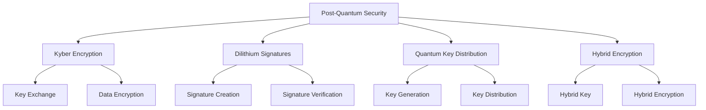
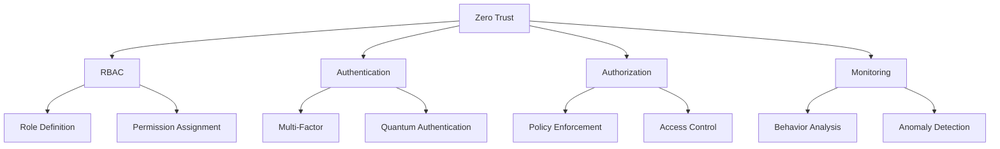

# Orchestratex AEM Security Guide

## Overview

This guide provides comprehensive security documentation for Orchestratex AEM, covering post-quantum cryptography, zero trust architecture, audit logging, and ethical guardrails.

## Security Architecture

### Post-Quantum Security

### Zero Trust Architecture

## Security Features

### Post-Quantum Cryptography
- Kyber encryption
- Dilithium signatures
- Hybrid encryption
- Quantum key distribution

### Zero Trust Implementation
- Role-based access control
- Quantum-safe authentication
- Continuous verification
- Micro-segmentation

### Audit & Monitoring
- Quantum-secured logging
- Entanglement-based audit trails
- Real-time monitoring
- Anomaly detection

## Security Best Practices

1. **Cryptography**
   - Use NIST-standard PQC
   - Implement hybrid encryption
   - Use quantum-safe key management
   - Regular key rotation

2. **Authentication**
   - Multi-factor authentication
   - Quantum-safe authentication
   - Continuous verification
   - Session management

3. **Authorization**
   - Role-based access control
   - Least privilege principle
   - Policy enforcement
   - Access logging

4. **Monitoring**
   - Real-time monitoring
   - Behavior analysis
   - Anomaly detection
   - Alerting

## Security Testing

1. **Cryptographic Testing**
   - Key exchange testing
   - Encryption testing
   - Signature testing
   - Hybrid encryption testing

2. **Authentication Testing**
   - Login testing
   - Session testing
   - Token testing
   - MFA testing

3. **Authorization Testing**
   - RBAC testing
   - Policy testing
   - Access control testing
   - Logging testing

4. **Monitoring Testing**
   - Alert testing
   - Detection testing
   - Response testing
   - Logging testing

## Security Policies

1. **Cryptography Policy**
   - Key management
   - Encryption standards
   - Signature standards
   - Key rotation

2. **Authentication Policy**
   - Login requirements
   - Session requirements
   - Token requirements
   - MFA requirements

3. **Authorization Policy**
   - Role requirements
   - Policy requirements
   - Access requirements
   - Logging requirements

4. **Monitoring Policy**
   - Alert requirements
   - Detection requirements
   - Response requirements
   - Logging requirements

## Security Recommendations

1. **Cryptography**
   - Use NIST-standard algorithms
   - Implement hybrid encryption
   - Use quantum-safe key management
   - Regular key rotation

2. **Authentication**
   - Use multi-factor authentication
   - Use quantum-safe authentication
   - Implement continuous verification
   - Use session management

3. **Authorization**
   - Use role-based access control
   - Implement least privilege
   - Use policy enforcement
   - Use access logging

4. **Monitoring**
   - Use real-time monitoring
   - Use behavior analysis
   - Use anomaly detection
   - Use alerting

## Security Contact

- **Project Lead:** DIGITAL-ANALOG
- **Developers:** Brooke / Perplexity Pro
- **Support:** McKown Media Solutions
  - **Email:** McKownmediasolutions@gmail.com
  - **Phone:** 216-336-8706

## Security Resources

- [NIST Post-Quantum Cryptography](https://csrc.nist.gov/projects/post-quantum-cryptography)
- [Zero Trust Architecture](https://csrc.nist.gov/projects/zero-trust)
- [Quantum Key Distribution](https://en.wikipedia.org/wiki/Quantum_key_distribution)
- [Hybrid Encryption](https://en.wikipedia.org/wiki/Hybrid_cryptosystem)

## Security Updates

- Regular security updates
- Regular vulnerability scanning
- Regular penetration testing
- Regular security audits
